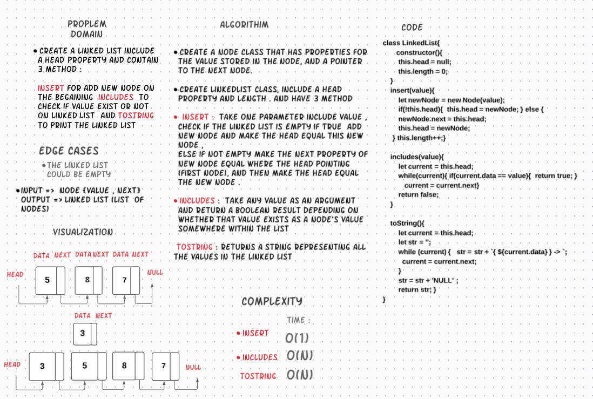
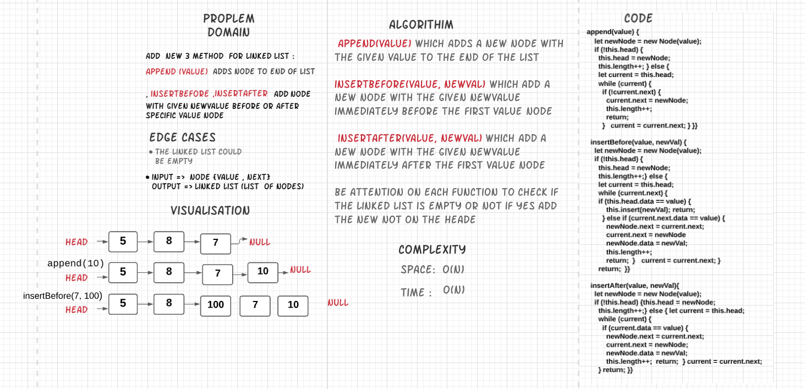
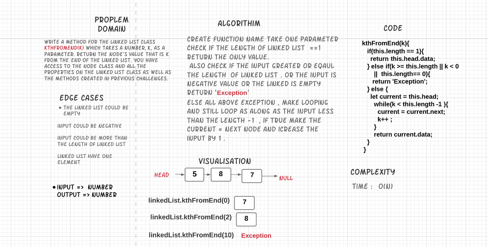

# Singly Linked List
What is a linked list? 
A linked list consists of nodes where each node contains data and a reference to the next node in the list.
Unlike an array, data is not stored in one contiguous block of memory and does not have a fixed size. Instead, it consists of multiple blocks of memory at different addresses. 

* Singly Linked List : that there is only one reference, and the reference points to the Next node in a linked list.  

* Each node contains :
the data for each link.
a property called Next,this contains the reference to the next node.

Head : reference of type Node to the first node in a linked list. 
Current is a reference of type Node to the node that is currently being looked at. 
Linked Lists depend on the Next value in each node to guide where the next reference is pointing  

## Challenge 1

* Create a Node class that has properties for the value stored in the Node, and a pointer to the next Node.
* Within your LinkedList class, include a head property. Upon instantiation, an empty Linked List should be created.
* Define a method called insert which takes any value as an argument and adds a new node with that value to the head of the list with an O(1) Time performance.
* Define a method called includes which takes any value as an argument and returns a boolean result depending on whether that value exists as a Node’s value somewhere within the list.
* Define a method called toString which takes in no arguments and returns a string representing all the values in the Linked List, formatted as:
`"{ a } -> { b } -> { c } -> NULL"`

## Challenge 2

build a new methods for linked list 

* append(value) which adds a new node with the given value to the end of the list
* insertBefore(value, newVal) which add a new node with the given newValue immediately before the first value node
* insertAfter(value, newVal) which add a new node with the given newValue immediately after the first value node

## Challenge 3

Write a method for the Linked List class  kthFromEnd(k)  which takes a number, k, as a parameter. Return the node’s value that is k from the end of the linked list. You have access to the Node class and all the properties on the Linked List class as well as the methods created in previous challenges.

                                                    k
        head -> [1] -> [3] -> [8] -> [2] -> null	0	2
        head -> [1] -> [3] -> [8] -> [2] -> null	6	Exception

## Approach & Efficiency

Why do we need linked list if we have arrays?  
For data insertion and deletion, arrays can be expensive. Linked list, on the other hand, has dynamic size and makes insertion and deletion so easy. One disadvantage though, unlike arrays, elements in linked list doesn’t have indexes in order, which doesn’t allow random access.

complixty :
insert from beginning : time O(1) , space O(1)  
print linked list (toString()) : time complexity is O(n)  
includes : time complexity is O(n)  
append(value) : time complexity is O(n)  
insertBefore(value, newVal) : time complexity is O(n)  
insertAfter(value, newVal) : time complexity is O(n)  
kthFromEnd(k) : time complexity is O(n)  

## API
* insert : takes the value as an argument then adds a new node in the beginning of the linked list 
time and space complexity:  O(1) 

* includes : take any value as an argument and return a boolean result depending on whether that value exists as a Node’s value somewhere within the list.  
The time complexity is O(n)

* toString : returns a string representing all the values in the Linked List  
The time complexity is O(n)

## API 2
* append(value) adds new node with the given value to the end of the list 

* insertBefore(value, newVal) add a new node with the given newValue immediately before the first value node
* insertAfter(value, newVal) add a new node with the given newValue immediately after the first value node

## API 3
* kthFromEnd(k) which takes a number, k, as a parameter. Return the node’s value that is k from the end of the linked list.

