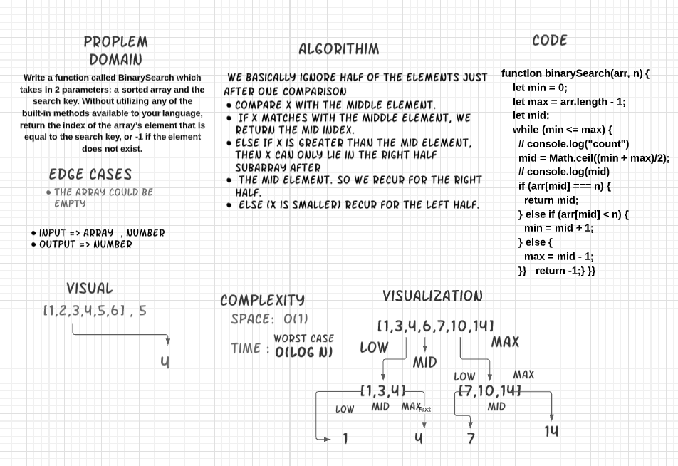

# Challenge Summary

Write a function called BinarySearch which takes in 2 parameters: a sorted array and the search key. Without utilizing any of the built-in methods available to your language, return the index of the array’s element that is equal to the search key, or -1 if the element does not exist.

## Challenge Description

**Binary Search** : Search in sorted array by repeatedly dividing the search interval in half. Begin with an interval covering the whole array. If the value of the search key is less than the item in the middle of the interval, narrow the interval to the lower half. Otherwise narrow it to the upper half. Repeatedly check until the value is found or the interval is empty.

 

## Approach & Efficiency

* We basically ignore half of the elements just after one comparison 
* Compare x with the middle element.
* If x matches with the middle element, we return the mid index.
* Else If x is greater than the mid element, then x can only lie in the right half subarray after
* the mid element. So we recur for the right half.
* else (x is smaller) recur for the left half.

 

* The time complexity of the binary search is:
        Worst Case O(log n).

* the space complexity of the binary search is O(1)

## Solution
 
