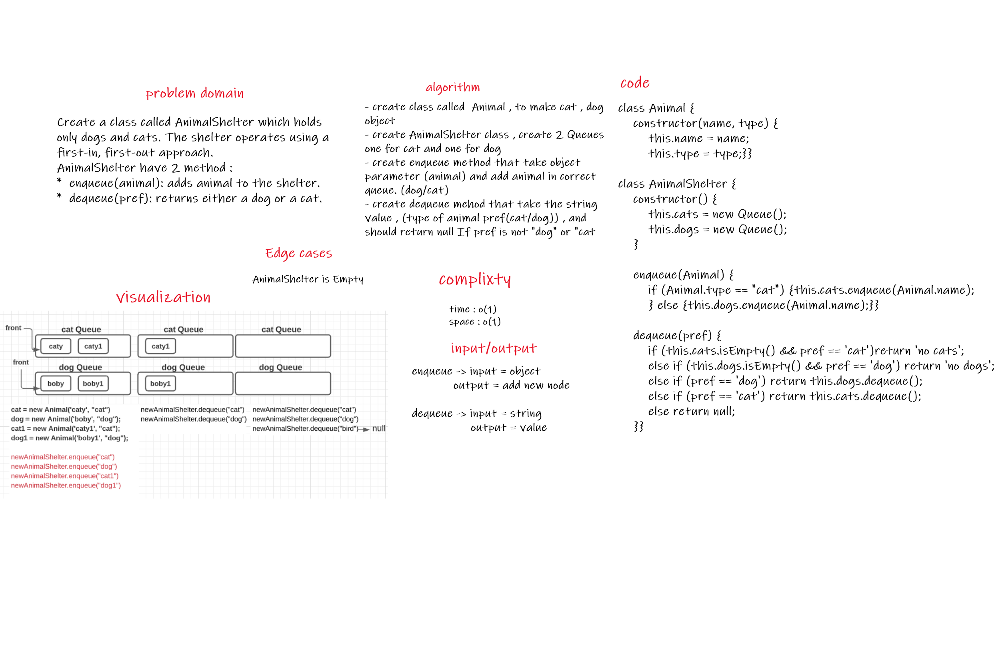

 # First-in, First out Animal Shelter.

## Challenge Summary

Create a class called AnimalShelter which holds only dogs and cats. The shelter operates using a first-in, first-out approach.

 

## Challenge Description
Implement the following methods:

* enqueue(animal): adds animal to the shelter. animal can be either a dog or a cat object.

* dequeue(pref): returns either a dog or a cat. If pref is not "dog" or "cat" then return null.

 

## Approach & Efficiency
Complixty :  space => O(1)
             Time => O(1)

 

## API
AnimalShelter have 2 method :
*  enqueue(animal): adds animal to the shelter.
*  dequeue(pref): returns either a dog or a cat.

 

## Solution

##  First-in, First out Animal Shelter.

