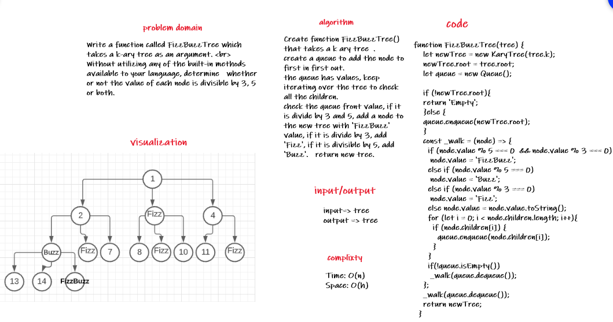

# Challenge Summary
Write a function called FizzBuzzTree which takes a k-ary tree as an argument

## Challenge Description

Write a function called FizzBuzzTree which takes a k-ary tree as an argument.  
Without utilizing any of the built-in methods available to your language, determine   whether or not the value of each node is divisible by 3, 5 or both.  

Create a new tree with the same structure as the original, but the values modified as follows:  
If the value is divisible by 3, replace the value with “Fizz”  
If the value is divisible by 5, replace the value with “Buzz”  
If the value is divisible by 3 and 5, replace the value with “FizzBuzz”  
If the value is not divisible by 3 or 5, simply turn the number into a String.  
Return a new tree.

## Approach & Efficiency

Time: O(n)  
Space: O(h)

## Solution

* Discussed the idea with Faten and Afnan

