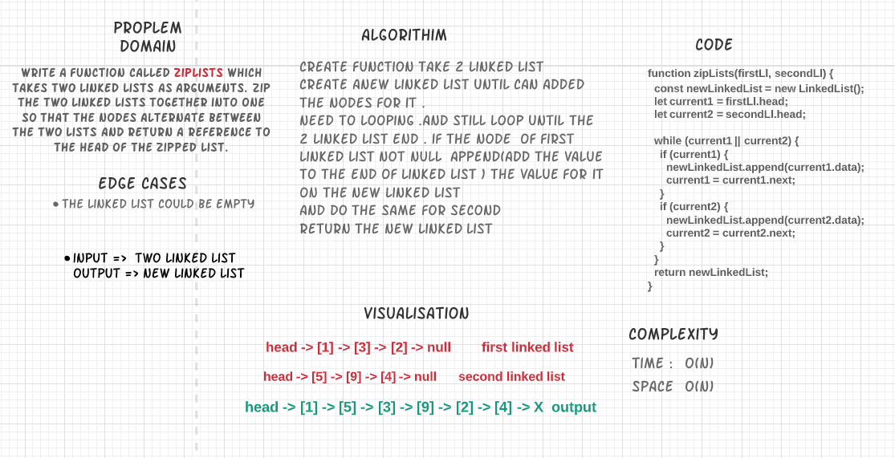

# zipLists

## Challenge Summary
Write a function called zipLists which takes two linked lists as arguments. Zip the two linked lists together into one so that the nodes alternate between the two lists and return a reference to the head of the zipped list.

example 
head -> [1] -> [3] -> [2] -> X	 first linked list
head -> [5] -> [9] -> [4] -> X	 second linked list

head -> [1] -> [5] -> [3] -> [9] -> [2] -> [4] -> X  output

## Challenge Description
> Write a function called zipLists which takes two linked and return zipped list.

used the append function for this zipLists function ,added to the end of the linked list .

        append(value) {
            let newNode = new Node(value);
            if (!this.head) {
            this.head = newNode;
            this.length++;
            } else {
            let current = this.head;
            while (current) {
                if (!current.next) {
                current.next = newNode;
                this.length++;
                return;
                }
                current = current.next;
            }
            }
        }

## Approach & Efficiency
complixty : time : O(n)
            space: O(n)

## Solution

