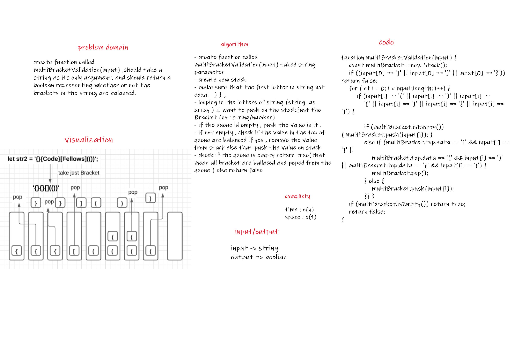

# Multi-bracket Validation.

# Challenge Summary

create function called multiBracketValidation(input) ,should take a string as its only argument, and should return a boolean representing whether or not the brackets in the string are balanced. There are 3 types of brackets:

Round Brackets : ()
Square Brackets : []
Curly Brackets : {}

## Challenge Description

        nput	                Output
        {}	T                    TRUE
        {}(){}	                 TRUE
        ()[[Extra Characters]]	 TRUE
        (){}[[]]	             TRUE
        {}{Code}[Fellows](())	 TRUE
        [({}]	                 FALSE
        (](	                     FALSE
        {(})                     FALSE

        
        Input	 Output  	
        {	      FALSE	    error unmatched opening { remaining.
        )	      FALSE	    error closing ) arrived without corresponding opening.
        [}	      FALSE	    error closing }. Doesn’t match opening (

## Approach & Efficiency

complixty : time : O(n)
            space: O(1)

## Solution

### Multi-bracket Validation.

