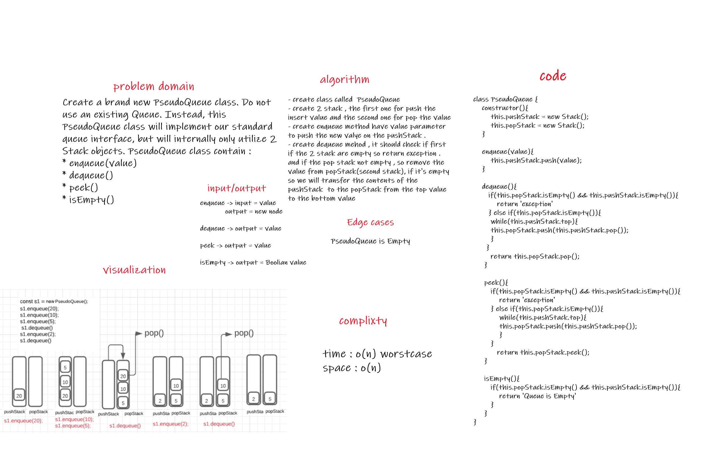

 # Queue-with-Stacks

## Challenge Summary

Create a brand new PseudoQueue class. Do not use an existing Queue. Instead, this PseudoQueue class will implement our standard queue interface, but will internally only utilize 2 Stack objects.

 

## Challenge Description
this PseudoQueue class contain : 

* enqueue(value) which inserts value into the PseudoQueue, using a first-in, first-out approach.

* dequeue() which extracts a value from the PseudoQueue, using a first-in, first-out approach.

    The Stack instances have only push, pop, and peek methods. You should use your own Stack implementation. Instantiate these Stack objects in your PseudoQueue constructor.

 

## Approach & Efficiency
Complixty :  space => O(n)
             Time => O(n) worst case

 

## API
PseudoQueue have 4 method :
*  enqueue(value) which inserts value into the PseudoQueue
*  dequeue() which extracts a value from the PseudoQueue
*  peek() which return the value of the node located in the front of the PseudoQueue
*  isEmpty() check if the PseudoQueue is empty or not

 

## Solution

##  Queue-with-Stacks

