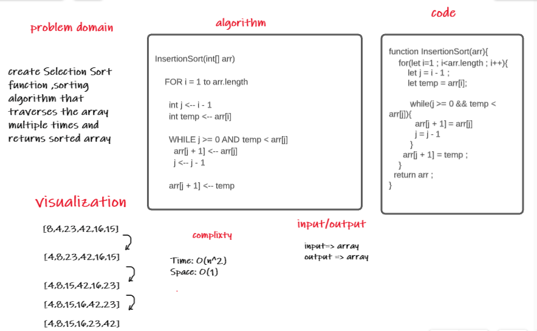

# Challenge Summary
Selection Sort is a sorting algorithm that traverses the array multiple times as it slowly builds out the sorting sequence. The traversal keeps track of the minimum value and places it in the front of the array which should be incrementally sorted.

## Challenge Description
 In the first pass through of the selection sort, we evaluate if there is a smaller number in the array than what is currently present in index 0. We find this smaller number right away in index 1. The minimum value gets updated to remember this index. At the end of the evaluation, the smaller number will be swapped with the current value in index i. This results in our smallest number of our array being placed first.

## Approach & Efficiency
  Time: O(n^2)
  Space: O(1)

## Solution

