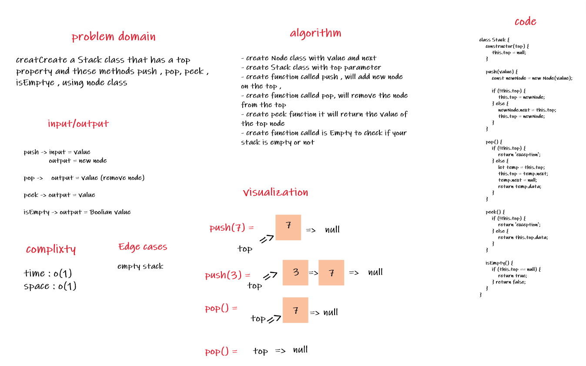
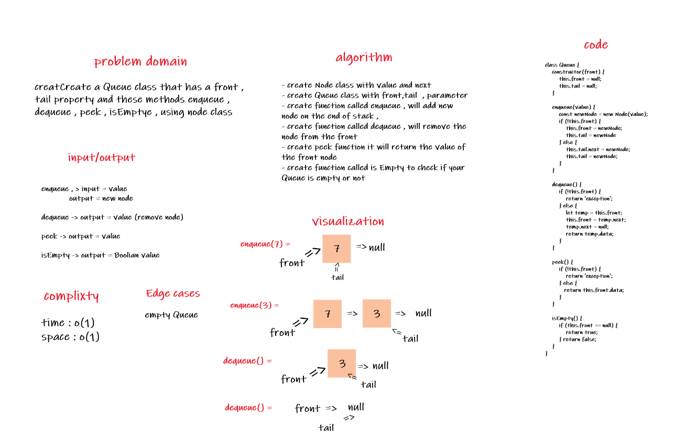

# stack-and-queue

## Challenge Summary
Create a Stack class that has a top property and these methods push , pop, peek , isEmpty
Create a Queue class that has a front property , and these methods enqueue ,dequeue ,peek,isEmpty

## Challenge Description
create Stack and Queue using node class .
Create a Node class that has properties for the value stored in the Node, and a pointer to the next node.

## Approach & Efficiency
complixty : time stack-and-queue: O(1))
            space stack-and-queue: O(1)

## Solution

## stack

## Queue

